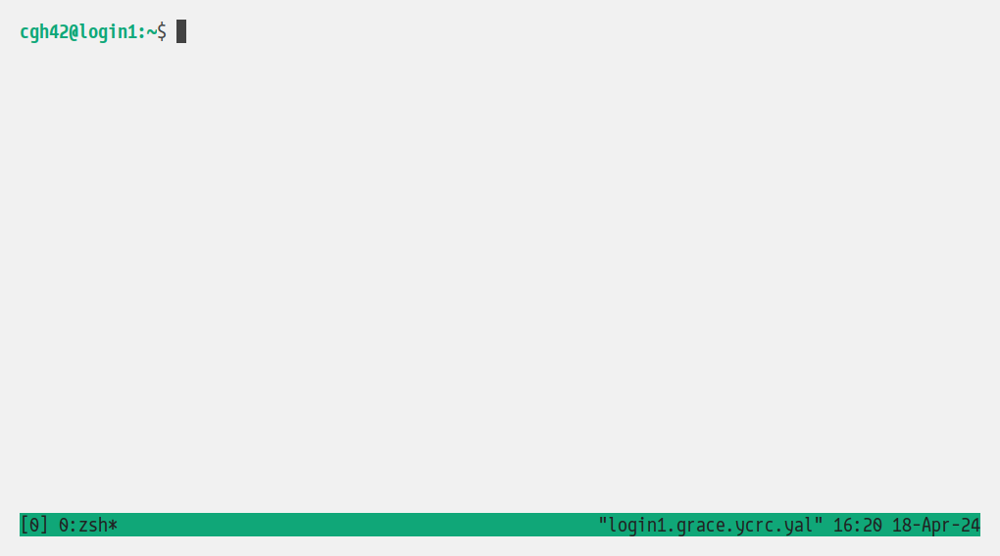
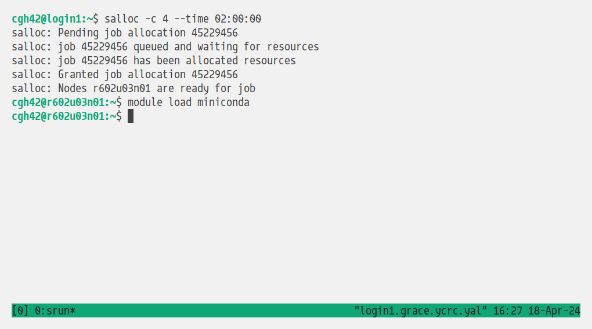

How to install PySCF on Grace
=============================

### Shortcut -- batch installation
I've written a [Slurm batch script](installpyscf.slurm) that does everything described below. Just change
the line `MY_NEW_ENV_NAME="my_new_env"` to set the new environment's name, then run `sbatch installpyscf.slurm`.

### Interactive installation
1. Log into Grace. Get a terminal session going. DON'T use Jupyter Lab; use a regular plain old terminal.
2. Run `tmux`. This will allow your session to survive if your network connection gets cut. 
    * To leave tmux (but keep the session alive), you can type `Ctrl-B D`. To return, run `tmux attach`.
    
        *Tmux looks something like this*
3. Run
    ```
    salloc -c 4 --time 02:00:00
    ```
    in your tmux to start an interactive session on the `devel` partition.
    * If you skip step 3 and decide to use the login node for the following steps, you might run into resource limits.

4. Grace has Conda installed. Load it via: `module load miniconda`
    
        *At this point, your terminal should look something like this*

5. Create a new Conda environment. As of April 2024, Python 3.11 is a good choice. To do this, run the command
    ```
    conda create -n my_new_env "python<3.12"
    ```
    replacing `my_new_env` with whatever you want to call it. Answer yes to the prompt, and wait.

6. Activate the new environment: `conda activate my_new_env`.
7. Run
    ```
    conda config --set pip_interop_enabled True

    echo "libblas=*=*mkl" >> $CONDA_PREFIX/conda-meta/pinned
    ```
    This helps Conda and pip work better together. It also ensures that NumPy and PySCF will use Intel Math Kernel Library for matrix multiplication.
8. Install PySCF.
    ```
    conda install pyscf -c conda-forge
    ```
    This will take a while. If it fails, just run the same command again---sometimes the downloads get disconnected for no good reason.
9. Install mpi4py.
    ```
    module load foss/2022b
    pip install mpi4py
    ```

10. If you want to use fcdmft, then you must also install cvxpy:
    ```
    conda install cvxpy -c conda-forge
    ```

That's it.
